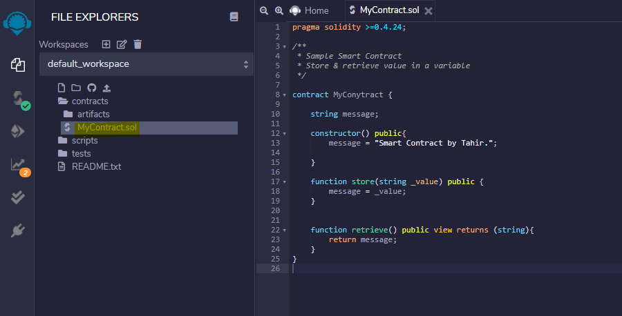
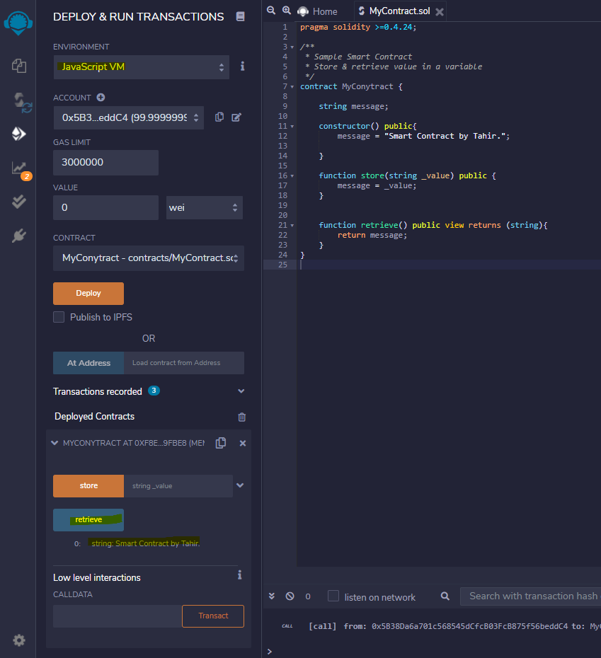

# Ethereum Smart Contract

This is an example of a [smart contract](https://www.youtube.com/watch?v=ZE2HxTmxfrI) written in [Solidity](https://docs.soliditylang.org) using [Remix - Ethereum IDE](https://remix.ethereum.org) to run on [Ethereum](https://ethereum.org/en/developers/docs/intro-to-ethereum) Blockchain.

Here are the three steps:

### Step 1 - Write a simple contract including Solidity 0.4.24:

### Step 2 - Compile using v0.4.25:

### Step 3 - Run using JavaScript VM (Test Blockchain within browser):

You can read further about writing contracts [here](https://www.dappuniversity.com/articles/solidity-tutorial).
